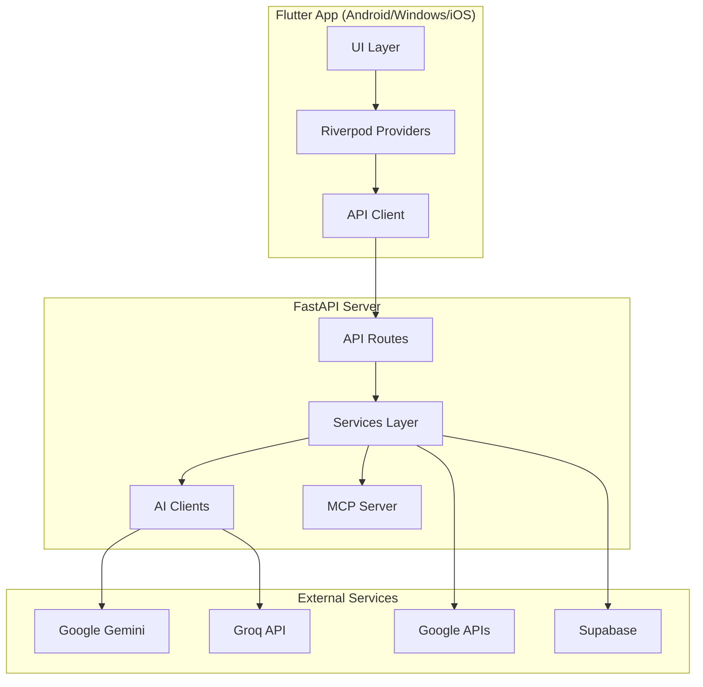
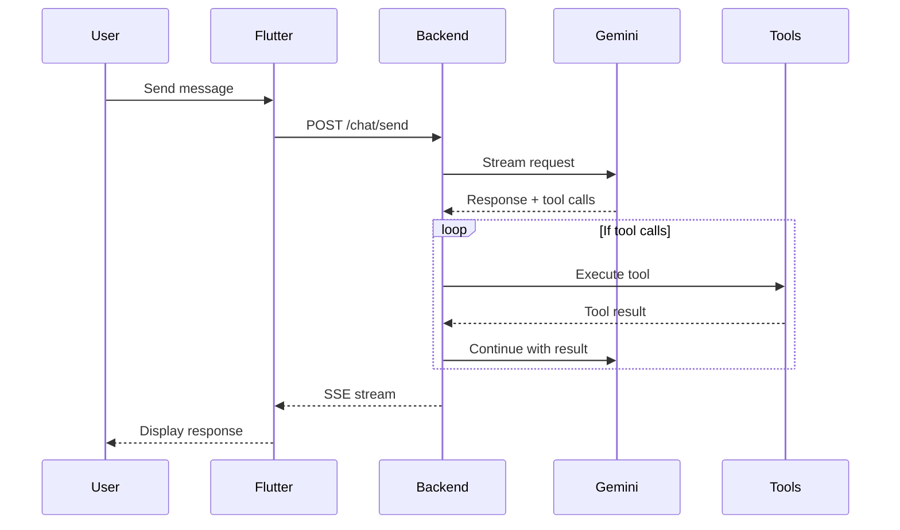
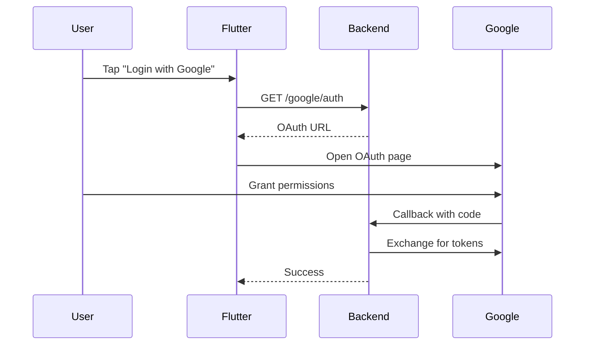

# Vyana Architecture

## System Overview

Vyana is a personal AI executive assistant with a client-server architecture.



## Components

### Flutter App (`apps/vyana_flutter/`)

| Component | Purpose |
|-----------|---------|
| `core/api_client.dart` | HTTP client for backend communication |
| `core/theme.dart` | App-wide theming and styling |
| `core/env_config.dart` | Build-time environment configuration |
| `features/*/` | Feature modules (chat, tasks, calendar, etc.) |

**State Management**: Riverpod with code generation
**Routing**: GoRouter with nested navigation

### Backend (`services/vyana_backend/`)

```
app/
├── main.py           # FastAPI app entry point
├── config.py         # Pydantic settings
├── routes/           # API endpoints
│   ├── chat.py       # Chat/AI endpoints
│   ├── tasks.py      # Task management
│   ├── calendar.py   # Google Calendar
│   ├── gmail.py      # Email endpoints
│   ├── voice.py      # Voice transcription
│   └── mcp.py        # MCP client routes
├── services/         # Business logic
│   ├── gemini_client.py  # Gemini AI
│   ├── groq_client.py    # Groq AI
│   ├── calendar_service.py
│   ├── gmail_service.py
│   └── tasks_repo.py     # SQLite storage
└── mcp/              # MCP server
    └── server.py     # FastMCP server
```

## Data Flow

### Chat Flow



### Authentication Flow



## AI Integration

### Dual Provider Strategy

| Provider | Use Case |
|----------|----------|
| **Gemini** | Primary AI for chat, reasoning, tool use |
| **Groq** | Voice transcription (Whisper), fast inference |

### Tool System

The AI can call tools to:
- Create/list tasks
- Read/create calendar events
- Send/read emails
- Search the web
- Access MCP servers (Zerodha, etc.)

## Security

| Aspect | Implementation |
|--------|----------------|
| API Keys | Stored in backend `.env` only |
| CORS | Configurable via `CORS_ORIGINS` |
| Auth | Google OAuth 2.0 |
| Secrets | No defaults, must be configured |

## Deployment

### Docker

```bash
cd services/vyana_backend
docker-compose up -d
```

### CI/CD

GitHub Actions workflows for:
- Android APK/AAB builds
- iOS IPA builds  
- Windows builds
- Backend linting and tests

## Future Considerations

- [ ] Add Redis for caching
- [ ] WebSocket for real-time updates
- [ ] Multi-user support
- [ ] Plugin system for tools
